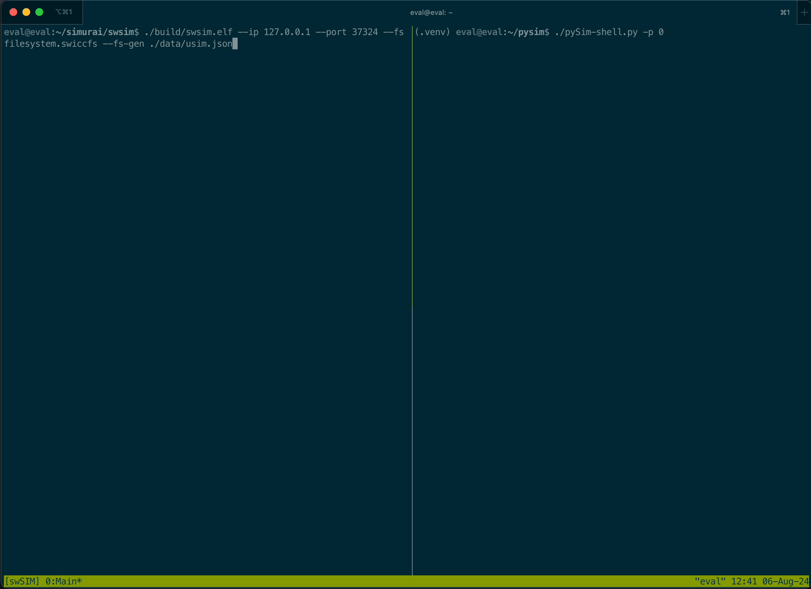
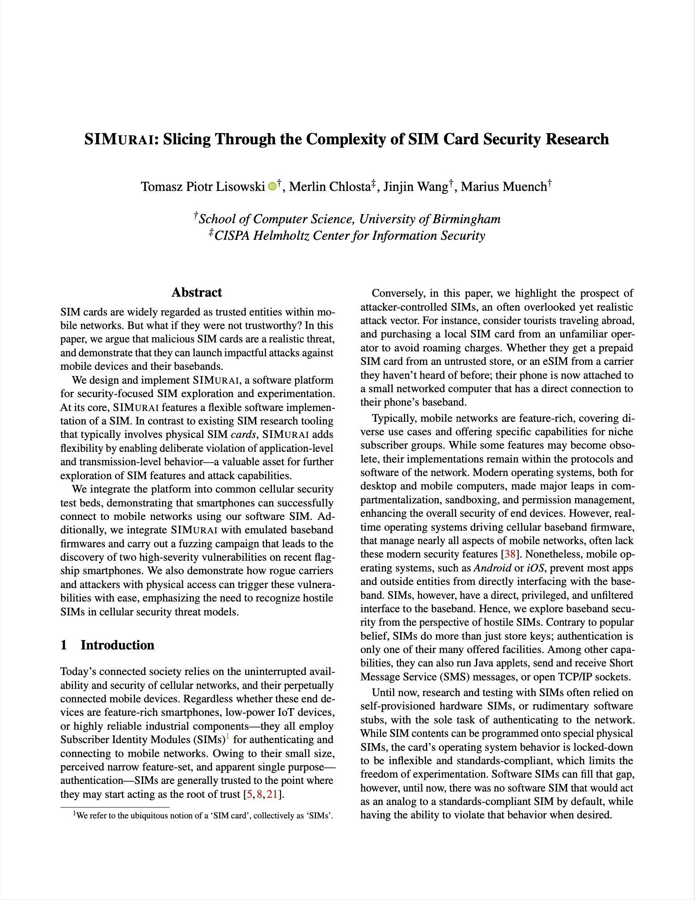

# SIMurai


SIMurai is a software platform designed for security-focused SIM exploration and experimentation. At its core, it offers a versatile software SIM implementation that can be integrated into various environments for advanced testing and development.

Our [paper at USENIX Security'24](https://www.usenix.org/conference/usenixsecurity24/presentation/lisowski) explains the features, design, and security-related experiments.

## Key Features

SIMurai is designed to be SIM-compatible for 2G/3G/4G/5G:
- File system
- MILENAGE authentication
- Proactive commands
- Control at the TPDU layer

User features:

- Response rewriting
- Custom command handling
- Proactive app creation and registration
- JSON file system definition (e.g. `./swsim/data/usim.json`)

SIMurai can be employed as a SIM replacement in multiple contexts, including:

- Smartphones, via SIMtrace 2 cardem.
- FirmWire, using a custom peripheral.
- any PC/SC-compatible clients, such as srsUE or pySIM.

For more detailed usage scenarios and instructions, please refer to the [SIMurai Artifact Evaluation Repository](https://github.com/tomasz-lisowski/simurai-usenixsec2024-ae). It contains instructions, scripts, and PCAPs to replicate the experiments from our paper.

See how SIMurai works with pySIM, like any other PC/SC-connected SIM card:



# Components

SIMurai consists of three primary components:

- swSIM: SIM card emulator.
- swICC: The underlying implementation of the smart card (ICC).
- swICC-pcsc: A virtual card reader for swICC-based cards. Compatible with the [PC/SClite middleware](https://pcsclite.apdu.fr/) that is used in most default PC/SC daemons (e.g. the debian/ubuntu `pcscd` package).

## Installation

Clone the repository with all submodules:
```bash
git clone --recurse-submodules git@github.com:tomasz-lisowski/simurai.git
```

Navigate to the subcomponent folders for specific installation instructions.

# Citing This Work
If you are using SIMurai in an academic paper, please reference [our USENIX Security'24 paper](https://www.usenix.org/conference/usenixsecurity24/presentation/lisowski):
```
@inproceedings{lisowski-simurai-2024,
  title = {{SIMurai: Slicing Through the Complexity of SIM Card Security Research}},
  shorttitle = {{SIMurai}},
  booktitle = {{USENIX Security Symposium}},
  author = {Tomasz Piotr Lisowski and Merlin Chlosta and Jinjin Wang and Marius Muench},
  year = {2024}
}
```

<a href="https://www.usenix.org/conference/usenixsecurity24/presentation/lisowski"></a>
